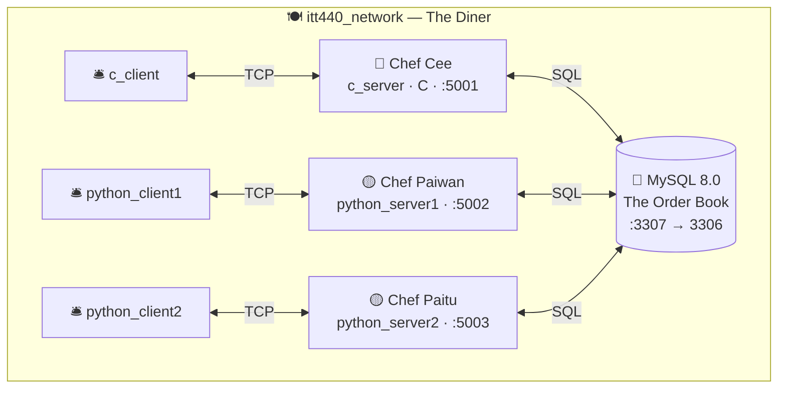

</div>
<div align="center">

# 🍽️ The Docker Diner

### *Where sockets are the special of the day.*


*A restaurant-themed, multi-container **socket programming** project for **ITT440 — Network Programming**.*

**Three chefs** (servers) cook, **three waiters** (clients) take orders, and one shared **Order Book** (MySQL) remembers everything — all served on a single Docker network. 🐳

</div>

---

## ✨ On the Menu Today

- 🧑‍🍳 **Multi-language chefs** — one **C** server and two **Python** servers, all speaking one simple text protocol.
- 🧵 **A multi-threaded C station** — a fresh thread for every waiter, plus a background *kitchen timer* that never stops cooking.
- 📒 **A smart Order Book** — history is logged automatically by a SQL **trigger**, and rankings come from a live **leaderboard view**.
- 🐳 **One-command service** — the whole diner boots from a single `docker-compose` file on a shared bridge network.
- ⏱️ **Always cooking** — every chef plates a new dish (and earns a point) every **30 seconds**.

---

## 👨‍🍳 Meet the Chefs

| | Chef | Station (service) | Language | Port | House Specialty |
|:--:|:--|:--|:--|:--:|:--|
| 🔴 | **Chef Cee** | `c_server` | C — raw POSIX sockets + threads | `5001` | Cooks fast, one thread per waiter |
| 🟡 | **Chef Paiwan** | `python_server1` | Python | `5002` | Friendly and reliable |
| 🟡 | **Chef Paitu** | `python_server2` | Python | `5003` | Same recipe, second station |
| 🟢 | **The Order Book** | `database` | MySQL 8.0 | `3307 → 3306` | Never forgets a single dish |

*Waiters on shift:* `c_client` · `python_client1` · `python_client2` 🛎️

---

## 🏗️ Kitchen Blueprint

Everything runs inside **one Docker bridge network** — that's how the containers find each other by name. Chefs talk to the Order Book; waiters talk to their chef.



---

## 🧑‍🍳 How the Kitchen Runs

1. Each **chef** opens its own port and waits at the counter. 🪑
2. Every **30 seconds** the chef cooks a dish — points **+1** — and logs it to the Order Book. 🍳
3. A **waiter** walks up, connects over TCP, and sends a one-line text command (e.g. `1`).
4. The chef runs a quick **MySQL** query, formats a friendly reply (with GMT+8 time ⏰), and sends it back.
5. The waiter prints the answer and asks again — until you type `exit`. 👋

> The whole protocol is just plain, newline-terminated text — so *any* waiter could chat with *any* chef.

---

## 🛎️ The Menu (Waiter Commands)

Walk up to any chef and ask:

| # | You ask... | Behind the scenes |
|:--:|:--|:--|
| 1️⃣ | 🍳 *"How many dishes have you cooked so far?"* | `GET_POINTS` |
| 2️⃣ | 🧾 *"Show me the updates for the last 5 dishes."* | `GET_HISTORY` |
| 3️⃣ | 🏆 *"Where do you stand on the Top Chef Board?"* | `GET_RANK` |
| 4️⃣ | ⏰ *"What time did the last dish go out?"* | `GET_TIME` |
| 5️⃣ | 🎁 *"Waiter's treat — award this chef extra points!"* | `ADD_POINTS` |
| 🚪 | *type* `exit` | Leave the counter |

---

## 🍳 Fire Up the Kitchen

**You'll need:** [Docker](https://docs.docker.com/get-docker/) + Docker Compose. That's it.

```bash
# 1. Clone the diner
git clone https://github.com/NadzmiAmsan/ITT440_Group_Project.git
cd ITT440_Group_Project

# 2. Open for business — start the Order Book + all three chefs
docker-compose up -d database c_server python_server1 python_server2

# 3. Check the pass — chefs "Up", Order Book "healthy"
docker ps
```

### 🛎️ Send in a waiter *(interactive — use a fresh terminal)*

```bash
docker-compose run --rm c_client         # → Chef Cee   (C)
docker-compose run --rm python_client1   # → Chef Paiwan (Python)
docker-compose run --rm python_client2   # → Chef Paitu  (Python)
```

### 👀 Watch a chef cook, live

```bash
docker logs -f itt440_c_server
```

---

## 📒 The Order Book (Database)

| 🔑 Setting | Value |
|:--|:--|
| Host | `database` |
| Port | `3306` *(mapped to `3307` on your machine)* |
| Database | `itt440_db` |
| User | `itt440_user` |
| Password | `itt440_pass` |

**What's inside** *(all created by `init.sql`):*

- 🍽️ **`socket_data`** — each chef's current points and last-update time.
- 🎞️ **`socket_data_history`** — every point change, written **automatically** by an `AFTER UPDATE` trigger (the kitchen CCTV).
- 🏆 **`leaderboard`** — a **view** that ranks chefs by points with a `RANK()` window function.

Peek inside the Order Book anytime:

```bash
docker exec -it itt440_database mysql -u itt440_user -pitt440_pass itt440_db
```
```sql
SELECT * FROM socket_data;
SELECT * FROM leaderboard;
SELECT * FROM socket_data_history ORDER BY updated_at DESC LIMIT 8;
```

---

## 🗂️ Kitchen Layout

```text
ITT440_Group_Project/
├── 🔴 c_server/          # C chef server (Chef Cee)          → service c_server
├── 🛎️ c_client/          # C waiter client                   → service c_client
├── 🟡 python_server/     # Python chef (Chef Paiwan)         → service python_server1
├── 🟡 python_server2/    # Python chef (Chef Paitu)          → service python_server2
├── 🛎️ python_client/     # Python waiter client              → service python_client1
├── 🛎️ python_client2/    # Python waiter client              → service python_client2
├── 📒 init.sql           # Tables + history trigger + leaderboard view
├── 🐳 docker-compose.yml # All services + the shared network
└── 🗒️ Dockerfile         # Legacy standalone C build (not used by compose)
```

> ℹ️ The database runs from the official `mysql:8.0` image in `docker-compose.yml` — the root `Dockerfile` is just a leftover build file and can be ignored.

---

## 🧯 Kitchen Mishaps (Troubleshooting)

| 🔥 Mishap | 🍽️ Fix |
|:--|:--|
| `docker logs itt440_c_server` is **empty** even though the container is `Up` | C buffers `stdout` when it writes to a pipe. Add `setvbuf(stdout, NULL, _IONBF, 0);` as the first line of `main()` in `c_server/server.c`, then `docker-compose up -d --build c_server`. |
| Want a **fresh service**? | `docker-compose down`, then `docker-compose up -d …` re-runs `init.sql` and reseeds the chefs from zero. |
| A chef didn't show up | `docker-compose up -d <service>` (e.g. `c_server`). |

---

## 👥 The Crew

| 🧑‍🍳 Station | 👤 On duty |
|:--|:--|
| C server & C client | *Idris* |
| Python server 1 & client 1 | *Aiman Afzan* |
| Python server 2, client 2 & the Order Book | **Nadzmi** |

---

<div align="center">

*Cooked with 🧡, ☕, and far too many `docker-compose up` commands.*

**ITT440 · Network Programming · UiTM**

⭐ *If you made it this far, the chefs say thank you!* ⭐

</div>
